Assignment 3-2: PathTracer
====================
Fanyu Meng

## Overview
In this project, we added more features to our path tracer in the 
previous project. The added features include enabling reflection and 
refraction,  rendering microfacet surfaces, environment light and depth 
of field.

## Part 1: Mirror and Glass Materials

We render mirror and glass materials by allowing light rays to be 
reflected and refracted during calculation. For mirror, we 
characterize mirror by setting its BRDF to constantly return the 
reflected ray w.r.t. surface normal. For glass BRDF, we return either 
the reflected ray or the refracted ray according to Schlick's 
reflection coefficient. The refraction direction is calculated using 
the Fresnel equation.

    <table width="100%" align="middle">
        <tr>
            <td align="middle">
                
                <figcaption align="middle"> 
                    Max depth of 0.
                </figcaption>
            </td>
            <td align="middle">
                
                <figcaption align="middle"> 
                    Max depth of 1.
                </figcaption>
            </td>
            <td align="middle">
                
                <figcaption align="middle"> 
                    Max depth of 2.
                </figcaption>
            </td>
            <td align="middle">
                
                <figcaption align="middle"> 
                    Max depth of 3.
                </figcaption>
            </td>
        </tr>
        <tr>
            <td align="middle">
                
                <figcaption align="middle"> 
                    Max depth of 4.
                </figcaption>
            </td>
            <td align="middle">
                
                <figcaption align="middle"> 
                    Max depth of 5.
                </figcaption>
            </td>
            <td align="middle">
                
                <figcaption align="middle"> 
                    Max depth of 6.
                </figcaption>
            </td>
            <td align="middle">
                
                <figcaption align="middle"> 
                    Max depth of 100.
                </figcaption>
            </td>
        </tr>
    </table>

Note that:

- At depth 0, like the previous project, we can only see the light 
directly comes from the light source;
- At depth 1, the spheres are pitch black. Although we should be able 
to see the reflected light source, the light is further away from the 
camera than the spheres and thus the spheres are only black;
- At depth 2, we start to see the reflection of the environment. This 
requires at least 2 bounces since we at least need a ray to travel in 
the form of light → mirror → object → camera for us to see reflections 
of the environment. The right sphere is mostly black since most rays 
are refracted and yet to be seen: light could be refracted once at 
this depth and is still inside the glass;
- At depth 3, we start to see refractions. This requires at least 3 
bounces since we at least need a ray to travel in the form of light → 
glass refract → glass refract → object → camera for us to see the 
refractions of the environment;
- At depth 4, we start to see the highlight under the glass sphere. 
This focus effect is due to two refractions and one reflection inside 
the glass. i.e., light → glass refract → glass reflect → glass 
refract → object → camera;
- At depth 5, we start to see the light spot on the right wall. This 
focus effect is due to two refractions and two reflections inside the 
glass. i.e., light → glass refract → glass reflect → glass reflect → 
glass refract → object → camera.

## Part 2: Microfacet Materials

We implement this feature with the microface BRDF by multiplying the 
Fresnel term, the shadowing-masking term, the normal distribution 
function (NDF) and some scalars. The Fresnel term is calculated using 
the refractive index and the extinction coefficient of the material, 
and the NDF is calculated using the Beckmann distribution. 

We also apply importance sampling to increase convergence rate. We do 
this by importance the half vector from the NDF and correctly scale 
the result. 

    <table width="100%" align="middle">
        <tr>
            <td align="middle">
                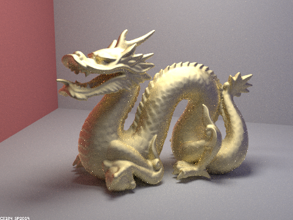
                <figcaption align="middle">alpha=0.5</figcaption>
            </td>
            <td align="middle">
                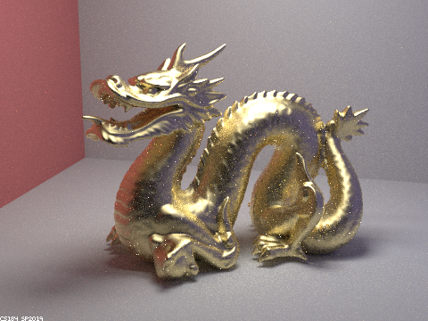
                <figcaption align="middle">alpha=0.25</figcaption>
            </td>
        </tr>
        <tr>
            <td align="middle">
                
                <figcaption align="middle">alpha=0.05</figcaption>
            </td>
            <td align="middle">
                
                <figcaption align="middle">alpha=0.005</figcaption>
            </td>
        </tr>
    </table>

As we can see, the material tends to diffuse when α is higher, and is 
more glossy when α is small.

    <table width="100%" align="middle">
        <tr>
            <td align="middle">
                
                <figcaption align="middle">Cosine hemisphere sampling</figcaption>
            </td>
            <td align="middle">
                
                <figcaption align="middle">Importance sampling</figcaption>
            </td>
        </tr>
    </table>

The image rendered with importance sampling much less noisy since it 
converges much faster than uniform sampling.

    
    <figcaption align="middle">
        Rendering metal cobalt using a different set of eta and k parameters.
    </figcaption>

## Part 3: Environment Light

The idea of environment light is that the environmental texture is 
considered as light sources infinitely far away and is mapped onto the 
materials. This way we can have a more realistic scene as if the 
objects are reflection the world.

We implement environment light by sampling from the environment 
texture from each directions. The 3D direction is converted into 2D 
texture coordinate and the corresponding value is recorded. We also 
incorporate importance sampling by sampling brighter points with a 
higher probability. We do this by pre-calculating the marginal 
environment light density for each pixel. 

    <table width="100%" align="middle">
        <tr>
            <td align="middle">
                
                <figcaption align="middle">Used environment map</figcaption>
            </td>
            <td align="middle">
                
                <figcaption align="middle">Corresponding probability CDF</figcaption>
            </td>
        </tr>
    </table>

    <table width="100%" align="middle">
        <tr>
            <td align="middle">
                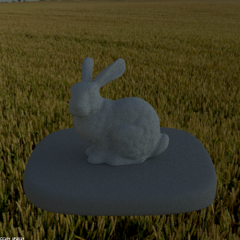
                <figcaption align="middle">Diffuse surface with uniform sampling.</figcaption>
            </td>
            <td align="middle">
                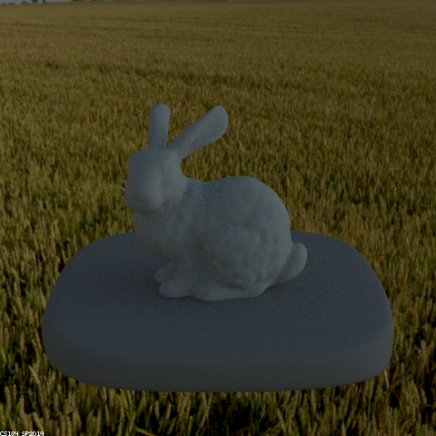
                <figcaption align="middle">Diffuse surface with importance sampling.</figcaption>
            </td>
        </tr>
        <tr>
            <td align="middle">
                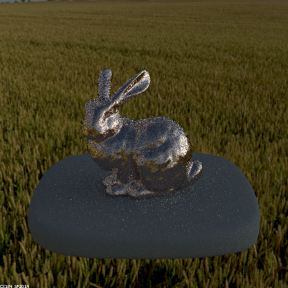
                <figcaption align="middle">Microfacet surface with uniform sampling.</figcaption>
            </td>
            <td align="middle">
                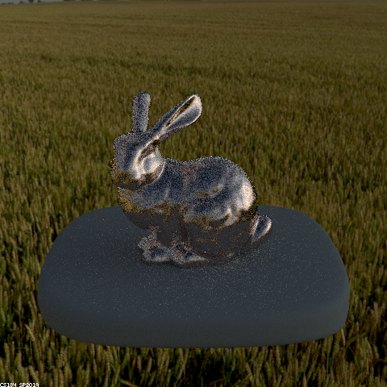
                <figcaption align="middle">Microfacet surface with importance sampling.</figcaption>
            </td>
        </tr>
    </table>

As we can see, using importance sampling on environment light makes 
rendering a diffuse object less noisy; however, on a more reflective 
object, the highlight area will be less noisy while darker areas will be
more noisy, since we are more likely to sample from brighter locations
on the environment light map.

## Part 4: Depth of Field

For a pinhole camera, all light received by the camera comes from the 
direction of the pinhole. However, this might not the be case for a 
thin lens camera. Light could be distorted by the thin lens and come 
from different directions. This created the idea of depth of field, that 
only objects in a certain range of distance are on focus, and other 
objects are blurred in the image.

We implement this feature by sampling on a disk with radius `lensRadius`
and centered at `pos` when generating the camera ray. Instead of 
returning the ray from the camera location to the given direction, we
return the ray from the random location of the disk to the corresponding
point on the focal plane. This allows the objects around the focal plane
to the on sharp while objects at other distances will be out of focus
and blurred.

    <table width="100%" align="middle">
        <tr>
            <td align="middle">
                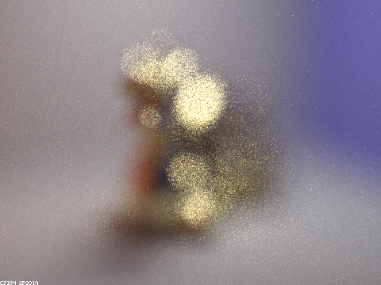
                <figcaption align="middle">Focused in front of the dragon.</figcaption>
            </td>
            <td align="middle">
                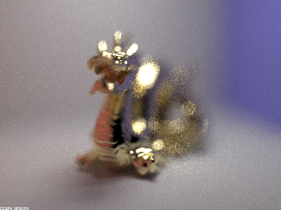
                <figcaption align="middle">Focused around the head of the dragon.</figcaption>
            </td>
        </tr>
        <tr>
            <td align="middle">
                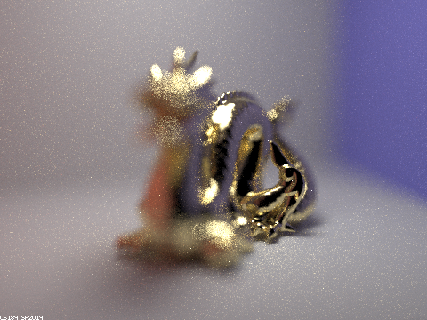
                <figcaption align="middle">Focused around the tail of the dragon.</figcaption>
            </td>
            <td align="middle">
                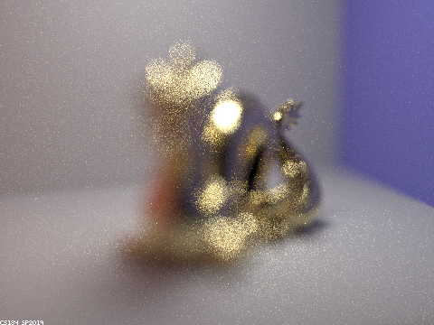
                <figcaption align="middle">Focused behind the dragon.</figcaption>
            </td>
        </tr>
    </table>

    <table width="100%" align="middle">
        <tr>
            <td align="middle">
                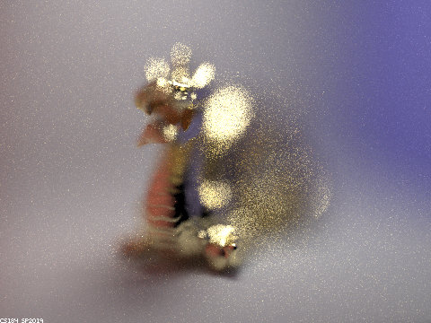
                <figcaption align="middle"><code>lensRadius = 0.5</code></figcaption>
            </td>
            <td align="middle">
                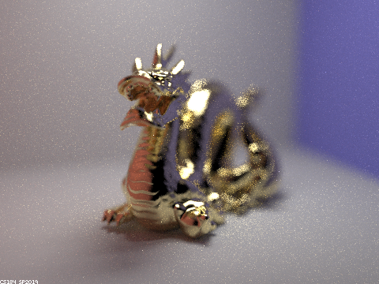
                <figcaption align="middle"><code>lensRadius = 0.1</code></figcaption>
            </td>
        </tr>
        <tr>
            <td align="middle">
                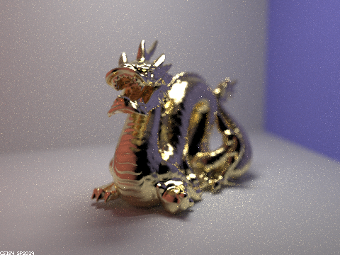
                <figcaption align="middle"><code>lensRadius = 0.05</code></figcaption>
            </td>
            <td align="middle">
                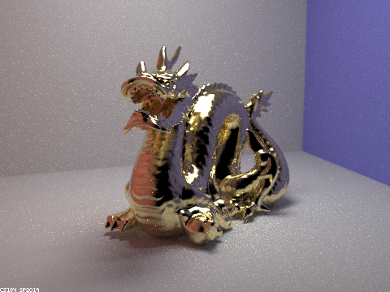
                <figcaption align="middle"><code>lensRadius = 0.01</code></figcaption>
            </td>
        </tr>
    </table>

As we can see, focused on the same plane, the smaller the lens radius is,
the more part of the object can be on focus. If `lensRadius = 0`, then
it should behave the same as if we did not implement the depth of field
feature.
